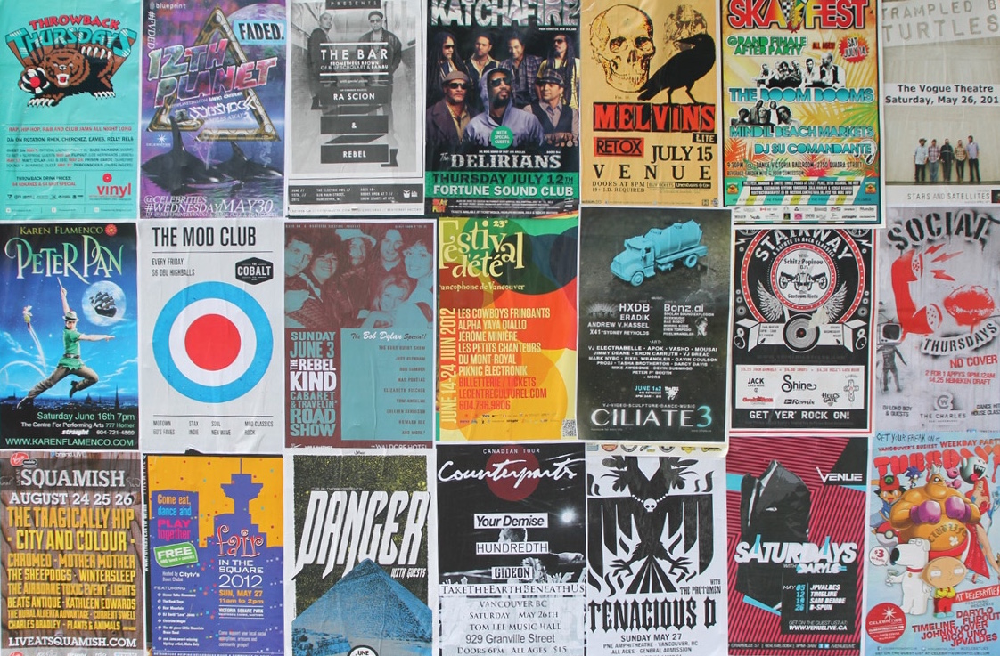
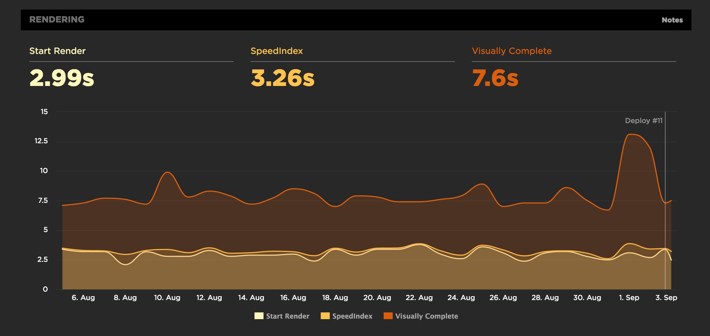
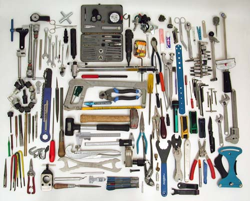
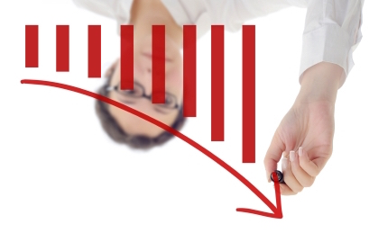
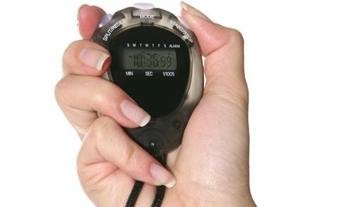
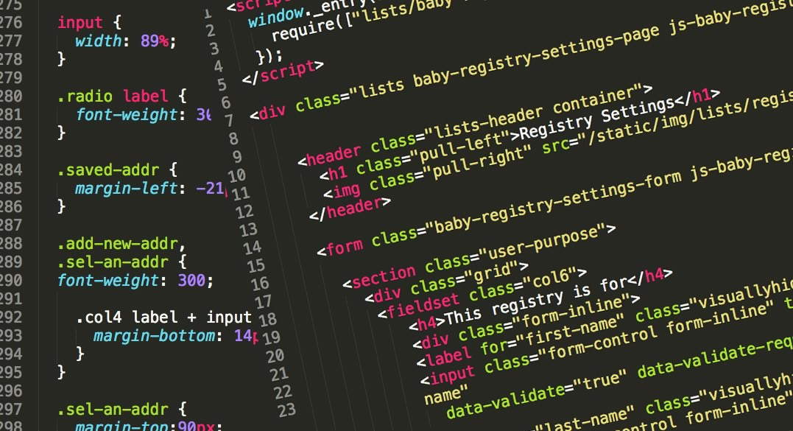
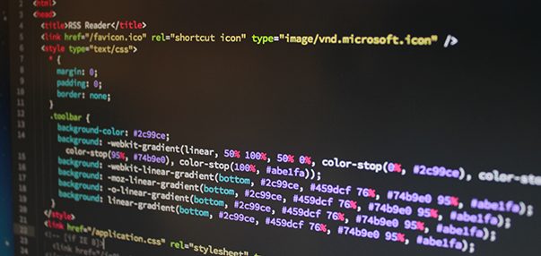

<!--
PDF made using http://www.decksetapp.com/
Fira Theme
Purple background
-->

### **2 fast, 2 furious?**

## How fast do you want your site to be?

^ Once all seated, shout outs

---

# Front-end Performance
## **#perfmatters**

^ speed is one thing
a consequence of good FED perf

---

# Big Faces

 

^ Intro selves
Name
Where work
What do

---

### **Table talk**

## How do fast sites make people feel?

^ 5m
Focus on positive
Your users, you, your boss
Report back: Call out one or two

---

## :zap: talk:  5m

^ local concerns for local people

---

### **Wall walk**

## Write at least one thing on each poster

^ HTML, CSS, JS, Server, WordPress, Other
10m: that's only 2m per thing!

---

# **Wall walk** summary

---

## How to measure Front-end performance?

---

## PageSpeed Insights
## WebPageTest

---

### **Today's goal**
## **Make it more gooder**

^ cheesy stock photo

-

## Pick one (PSI or WPT)
## Pick a metric

---

### **Benchmark**

## Run the tool
## Write down your score

^ 5m

---

# **Code!**

^ **20m**

---

### **Pair share**

## Find someone new
## Tell them 1 thing you've done

^ 2m
other side of the room
to improve FED performance

---

# **Code!**

^ **20m**

---

### **Measure**

## Run the tool
## Write down your score

---

---

## **^**:five: :clap: :thumbsup:
## Get a sticker!

---

### **Hey buddy**

## Choose a SMART goal
## Swap cards with a buddy

^ 5m

---

### **Facilitator Feedback**

## 1 thing you liked
## 1 thing we could change

^ 5m

---

### Facilitator spam

### steve@naga.co.za
### danielle.lisa.eriksen@gmail.com

 
