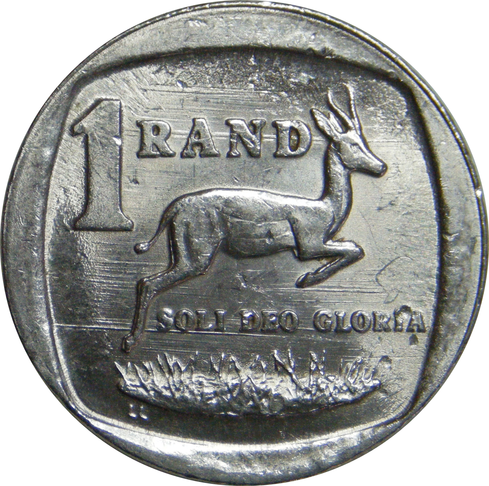
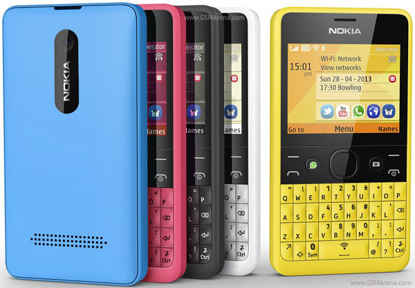
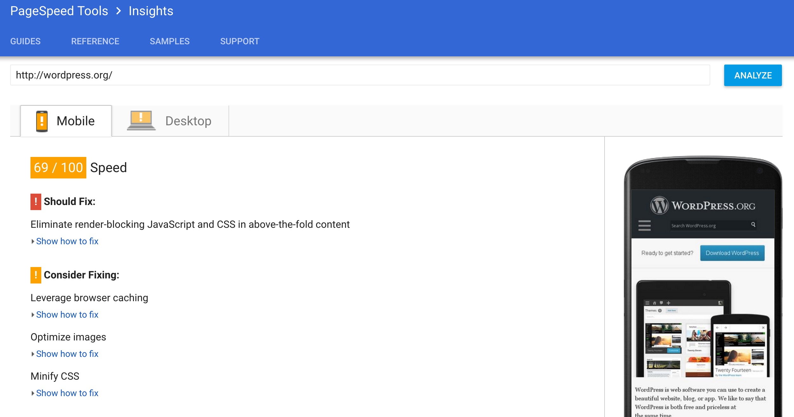

<!--
PDF made using http://www.decksetapp.com/
Fira Theme
Purple background
-->

# Front-end Performance
## **#perfmatters**

^ help start (or continue) your PerfFED journey
Can be hard to find time during work
Only one hour, so TIGHT SHIP

---

# Big Faces

 

^ Intro selves
Name
Where work
What do

---

### **Table talk**

## Introduce yourself
## How do performant sites make people feel?

^ 5m
Focus on positive
Your users, you, your boss
Report back: Call out one or two

---

## **South African context**

# 1. Data
# 2. Devices

^ reality / OMG check
two big things
What about Data?

---

## **1. Data**
# R1.5 per page

^ Vodacom pre-paid - 15Mb for R9 - R0.60 per MB
httparchive.org - Average page size: 2.5MB
"worst case"? yes. that's our job!

---

## Cashier R5,000 / month
## 10 pages a day
## **9% of daily income**

^ Stats SA Survey 2015
What about carousel / slider with 5 huge images?

---

# :scream: :scream: :scream:

^ What about Devices?

---

## **2. Devices**
# Phones are older, slower

^ featurephones on the way out, yes
but cheap, low-power, smartphones
Lower CPU, RAM. Struggle with lots of JS.

---

### **Wall walk**

## Write at least one thing about FED performance on each poster

^ HTML, CSS, JS, WordPress, Other
5m: that's only 1m per thing!

---

# **Wall walk** summary

^ 5m

---

## How to measure Front-end performance?

^ ask audience

---

## **PageSpeed Insights**
## (also WebPageTest if you're feeling fancy)

^ we'll use these tools today
mostly focus on PSI. who knows it?
not because OMG Google :100:, but because good advice
use as checklist

---

^ Live Demo!
Sort of

---

### **Today's goal**
## Make it more gooder
### (improve your score)

^ cheesy stock photo
PSI score up (other stuff down)

---

### **Benchmark**

## Run PSI
## Note your score

^ 5m
Or run WPT (on 3g, mobile?), pick a metric

---

## Put a :red_circle:
## on the wall
## for your before score

^ Your PSI score
We'll come back to this later

---

# **PerfFED!**
## Pick **one thing** to focus on

^ 10m?

---

## **Resources**

## PageSpeed docs
## naga.co.za/wc2016

^ short URL

---

### **Measure**

## Run PSI
## Note your score

^ 5m, inc wall sticker

---

## Put a :star:
## on the wall
## for your after score

^ who's site is more gooder than earlier today?

---

## :thumbsup:
## Get a sticker!

^ One sheet of stickers for each table

---

## **Hey buddy**

^ 5m
keep on keepin' on
today was just the start

---

## Choose a **SMART** goal
## Write it on an index card

^ specific, measurable, attainable, realistic, time-bound

---

## Write your **name** and **email** on the back
## **Swap cards** with a buddy

---

### **Front-end Performance: Facilitator spam**

### danielle.lisa.eriksen@gmail.com
### steve@naga.co.za

 
