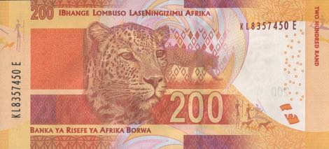

<!--
PDF made using http://www.decksetapp.com/
Fira Theme
Purple background
-->

### **2 fast, 2 furious?**

## How fast is fast enough?
## How fast do you want your site to be?

^ Once all seated, shout outs

---

# Front-end Performance
## **#perfmatters**

^ speed is one thing
a consequence of good FED perf

---

# Big Faces

 

^ Intro selves
Name
Where work
What do

---

### **Table talk: 5m**

## How do fast sites make people feel?

^ Focus on positive
Your users, you, your boss
Report back: Call out one or two

---

---

## :zap: talk:  5m

^ local concerns for local people

---

# South African
# context

^ two big things

---

# **1.** Data is expensive

^ many SA consumers on pre-paid.
data is not cheap.
throw some numbers around to paint picture

---

## Vodacom pre-paid
## 100Mb for R29
## **R0.29 per MB**

^ Vodacom, pre-paid

---

## httparchive.org

# Average page size: 2.5MB

^ who's page is smaller?
who's page is bigger?

---

# Nearly R1 per page

---

# **¯\\\_(ツ)\_/¯**

^ How many pages per site?
How many sites?

---

## Cashier R5,000 / month
## R165 a day

^ No so bad?
What about our users?
Stats SA Survey 2015

---

## 10 pages a day
## 6% of daily income

^ Assumes average size page
What about carousel / slider with 10 unoptimised images?

---

# :scream: :scream: :scream:

---

# **2.** Phones are older, slower

^ featurephones on the way out, yes
but cheap, low-power, smartphones

---

# CPU speed

^ TODO: add numbers, explain

---

# RAM

^ TODO: add numbers, explain

---

# Feature support

^ What is this CSS3 of which you speak?
TODO: explain a bit

---

### **Wall walk: 10m**

## Write at least one thing on each poster

^ HTML, CSS, JS, Server, WordPress, Other
10m: that's only 2m per thing!

---

# Wall walk summary

---

## How to measure Front-end performance?

---

## PageSpeed Insights
## WebPageTest

---

### **Today's goal**

## Pick one (PSI or WPT)
## Pick a metric
## **Make it more gooder**

---

### **Benchmark: 5m**

## Run the tool
## Write down your score

---

# **Code!**
# **20m**

---

### **Pair share: 2m**

## Find someone new
## Tell them 1 thing you've done

^ other side of the room
to improve FED performance

---

# **Code!**
# **20m**

---

### **Measure again**

## Run the tool
## Write down your score

---

## **^**:five: :clap: :thumbsup:
## Get a sticker!

---

### **Hey buddy: 5m**

## Choose a SMART goal
## Swap cards with a buddy

---

### **Facilitator Feedback: 5m**

## 1 thing you liked
## 1 thing we could change

---

### Facilitator spam

### steve@naga.co.za
### danielle.lisa.eriksen@gmail.com

 
