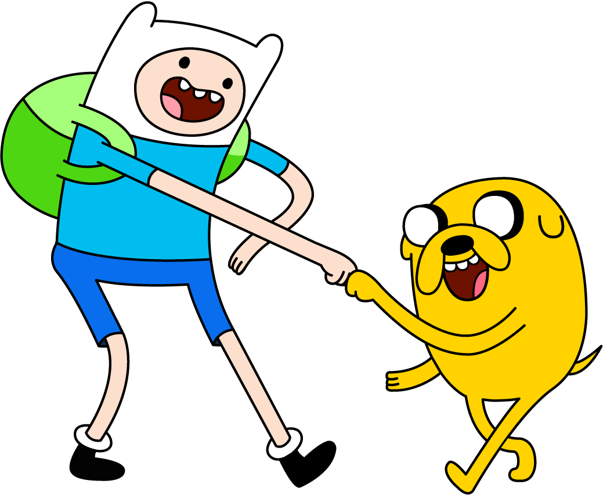

<!--
PDF made using http://www.decksetapp.com/
Fira Theme
Purple background
-->

# Front-end Performance

^ up while we wait for everyone to arrive

---

### **2 fast, 2 furious?**

## How fast do you want your site to be?

^ Once all seated, shout outs

---

# Front-end Performance
## **#perfmatters**

^ speed is one thing
a consequence of good FED perf

---

# Big Faces

 

^ Intro selves
Name
Where work
What do

---

### **Table talk**

## Introduce yourself
## How do fast sites make people feel?

^ 5m
Focus on positive
Your users, you, your boss
Report back: Call out one or two

---

## :zap: talk:  5m

^ local concerns for local people

---

### **Wall walk**

## Write at least one thing on each poster

^ HTML, CSS, JS, Server, WordPress, Other
10m: that's only 2m per thing!

---

# **Wall walk** summary

---

## How to measure Front-end performance?

^ ask audience

---

## **PageSpeed Insights**
## (also WebPageTest if you're feeling fancy)

^ we'll use these tools today
mostly focus on PSI
not because OMG Google :100:, but because good advice
if **fancy**, do WPT

---

### **Today's goal**
## Make it more gooder
### (improve your score)

^ cheesy stock photo
PSI score up (other stuff down)

---

### **Benchmark**

## Run PSI
## Note your score

^ 5m

---

## Put a :red_circle:
## on the wall
## for your before score

^ Your PSI score
We'll come back to this later

---

# **Code!**

^ **20m**

---

### **Pair share**

## Find someone new
## Tell them 1 thing you've done

^ 2m
other side of the room
to improve FED performance

---

# **Code!**

^ **20m**

---

### **Measure**

## Run PSI
## Note your score

^ 5m
who's site is more gooder than earlier today?

---

## Put a :star:
## on the wall
## for your after score

^ talk through the change

---

## :thumbsup:
## Get a sticker!

^ Steve walk around with stickers

---

## **Hey buddy**

^ 5m
keep on keepin' on
today was just the start

---

## Choose a **SMART** goal
## Write it on an index card

^ specific, measurable, attainable, realistic, time-bound

---

## Write your **name** and **email** on the back
## **Swap cards** with a buddy

---

### **Facilitator Feedback**

## 1 thing you liked
## 1 thing we could change

^ 5m

---

### **Front-end Performance: Facilitator spam**

### danielle.lisa.eriksen@gmail.com
### steve@naga.co.za

 
