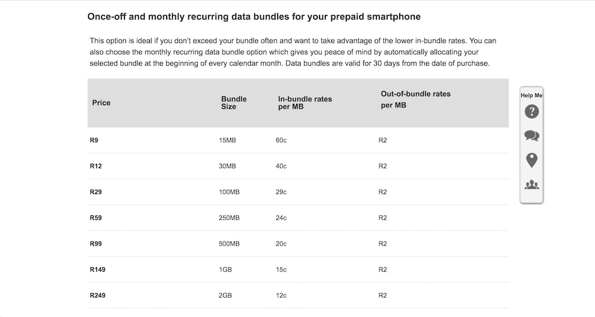
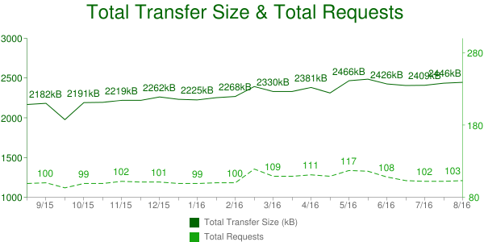
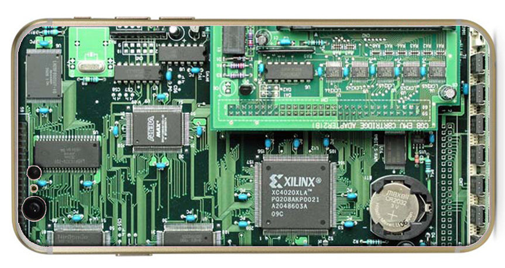
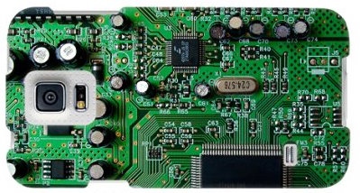
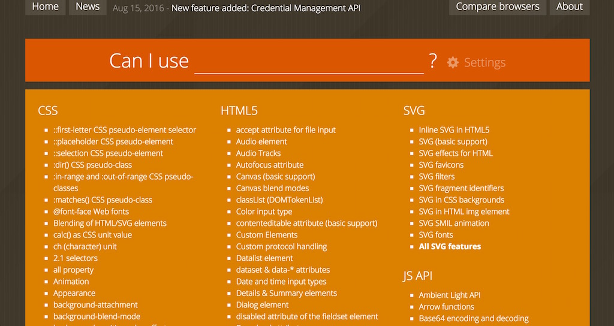

# South African context

# **1.** Data
# **2.** Devices

^ two big things

---

# **1.** Data is expensive

^ many SA consumers on pre-paid.
data is not cheap.
throw some numbers around to paint picture

---

# Vodacom pre-paid
# 15Mb for R9
# **R0.60 per MB**

^ Worst case
Vodacom, pre-paid
This is in-bundle rates
Out is much higher

---

# httparchive.org

# Average page size: **2.5MB**

^ who's page is smaller?
who's page is bigger?

---

# **R1.5 per page**

---

# **¯\\\_(ツ)\_/¯**

^ Not so bad?
How many pages per site?
How many sites?
What about our users?

---

# Stats SA Survey 2015
# Cashier R5,000 / month
# **R165 a day**

^ Bongani

---

# 10 pages a day
# Total R15
# **9% of daily income**

^ Assumes average size page
What about carousel / slider with 10 unoptimised images?

---

# :scream: :scream: :scream:

---

# **2.** Phones are older, slower

^ featurephones on the way out, yes
but cheap, low-power, smartphones

---

# CPU speed

^ TODO: add numbers, explain

---

# RAM

^ TODO: add numbers, explain

---

# Feature support

^ What is this CSS3 of which you speak?
TODO: explain a bit
